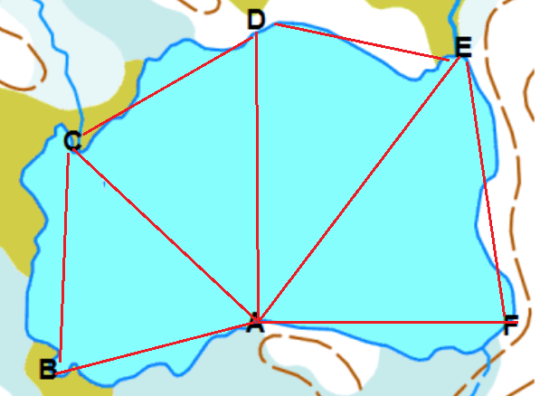
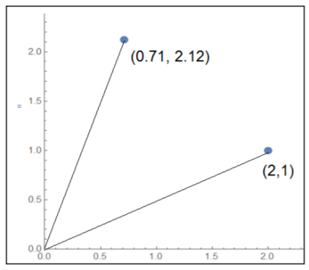
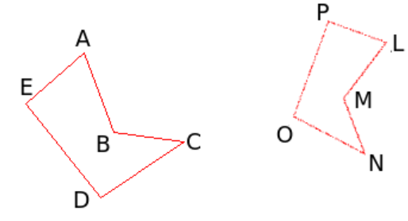

# Geometriaa matriiseilla

Matriisilaskentaa voidaan hyödyntää geometriassa. Tätä varten tarvitaan myös vektorilaskentaa. Jos vektorit ovat suunnikkaan sivuvektoreita, niistä voidaan muodostaa matriisi, jonka determinantti kertoo suunnikkaan koon. Toinen sovellus on koordinaatiston kierto. Tällöin koordinaatiston pistettä kuvaava vektori kerrotaan matriisilla, jonka alkiot määrittelevät kierron suunnan ja suuruuden.

## Pinta-alojen laskeminen

Vektorilaskennasta muistetaan, että jos suunnikkaan sivuvektorit ovat $\vec{AB}$ ja $\vec{AD}$, niin suunnikkaan ala on $S=|\vec{AB}\times \vec{AD}|$ ja vastaavan kolmion ala $K=\frac{1}{2} S$. Matriisilaskennan lähestymistapa asiaan on seuraava:

Jos suunnikkaan sivuvektorit ovat $\vec{AB}=x_1 \vec{i}+y_1 \vec{j}$ ja $\vec{AC}=x_2 \vec{i}+ y_2 \vec{j}$ ja ne täydennetään kolmialkioisiksi ja lasketaan ristitulo, saadaan 

$\vec{AB}\times \vec{A} = \begin{vmatrix} \vec{i} & \vec{j} & \vec{k} \\ x_1 & y_1 & 0 \\ x_2 & y_2 & 0 \end{vmatrix} = (y_1\cdot 0 -y_2 \cdot 0) \vec{i} - (x_1 \cdot 0 -x_2 \cdot 0) \vec{j} + (x_1 y_2 -x_2 y_1) \vec{k}$.

Determinantin määritelmän perusteella voidaan kirjoittaa $\vec{AB}\times {AC} = \begin{vmatrix} x_1&y_1\\x_2&y_2\end{vmatrix} \vec{k}$.

Suunnikkaan ala $S$ on ristitulon itseisarvo, siis 

$S=\left|\begin{vmatrix}x_1&y_1\\x_2&y_2\end{vmatrix} \vec{k}\right|=\left|\begin {vmatrix} x_1&y_1\\x_2&y_2\end{vmatrix}\right|$, 

ja kolmion ala on

$K=\frac{1}{2} S = \frac{1}{2} \left|\begin{vmatrix}x_1&y_1\\x_2&y_2\end{vmatrix}\right|$. 

Pinta-alat saadaan siis laskemalla determinantti matriisista, jonka riveillä ovat suunnikkaan sivuvektorien komponenttien kertoimet.

**Esim.** Kolmion kärkipisteet ovat $A=(0.5,2)$, $B=(1.5,0.5)$ ja $C=(3.5,1.5)$. Laske kolmion ala.

:::{admonition} Ratkaisu
:class: tip, dropdown

Kun sivuvektoreiksi valitaan $\vec{BA}=-\vec{i}+1.5\vec{j}$ ja $\vec{BC}=2\vec{i}+\vec{j}$, niin kolmion alaksi saadaan

$K=\frac{1}{2} |\begin{vmatrix}-1&1.5\\2&1\end{vmatrix}|= \frac{1}{2} |-1\cdot 1-2\cdot 1.5|=\frac{1}{2}\cdot 4=2$.

Sama tulos saataisiin myös, jos valittaisiin sivuvektoreiksi $\vec{AB}$ ja $\vec{AC}$.

:::

Epäsäännöllisen alueen pinta-alan määrittäminen onnistuu jakamalla alue useiksi kolmioiksi ja laskemalla kolmioiden pinta-alat edellisellä menetelmällä.

**Esim.** Lammen ympäriltä on mitattu koordinaattipisteet A = (810, 80); B = (500, 60); C = (550, 350) ; D =(820, 550); E =(1070, 530); F = (1090, 70). Arvioi lammen ala saadaan kolmioiden ABC, ACD, ADE ja AEF alojen summana. 

:::{admonition} Ratkaisu
:class: tip, dropdown

Tarvitaan seuraavat sivuvektorit:

$\vec{AB}=(500-810) \vec{i}+(60-80) \vec{j}=-310 \vec{i}-20 \vec{j}$

$\vec{AC}=(550-810) \vec{i}+(350-80) \vec{j}=-260 \vec{i}+270 \vec{j}$

$\vec{AD}=(820-810) \vec{i}+(550-80) \vec{j}=10 \vec{i}+470 \vec{j}$

$\vec{AE}=(1070-810) \vec{i}+(530-80) \vec{j}=260 \vec{i}+450 \vec{j}$

$\vec{AF}=(1090-810) \vec{i}+(70-80) \vec{j}=280 \vec{i}-10 \vec{j}$

Lammen ala $A_L$ muodostuu kolmioiden pinta-aloista:

$A_L=A_{ABC}+A_{ACD}+A_{ADE}+A_{AEF}=$

$\frac{1}{2} \left|\begin{vmatrix}-310&-20\\-260&270\end{vmatrix}\right|+ \frac{1}{2} \left|\begin{vmatrix}-260&270\\10&470\end{vmatrix}\right|+ \frac{1}{2} \left|\begin{vmatrix}10&470\\260&450\end{vmatrix}\right|+ \frac{1}{2} \left|\begin{vmatrix}260&450\\280&-10\end{vmatrix}\right|=$

$\frac{1}{2} (\left|\begin{vmatrix}-310&-20\\-260&270\end{vmatrix}\right| + \left|\begin{vmatrix}-260&270\\10&470\end{vmatrix}\right| + \left|\begin{vmatrix}10&470\\260&450\end{vmatrix}\right| + \left|\begin{vmatrix}260&450\\280&-10\end{vmatrix}\right|)=$

$ \ldots = 230 050 (\text{m}^2)$

Octavessa lasku onnistuisi esimerkiksi seuraavasti:

AB=[-310 -20], AC=[-260 270], AD=[10 470], AE=[260 450], AF=[280 -10]

M1=[AB;AC], M2=[AC;AD], M3=[AD;AE], M4=[AE;AF]

ala=0.5*(abs(det(M1))+abs(det(M2))+abs(det(M3))+abs(det(M4)))

:::

## Kiertomatriisit ja koordinaattimuunnokset

Kiertomatriisit ovat matriisien sovelluskohteita niin kartoissa kuin kuvankäsittelyssäkin. Kiertomatriiseja käytettäessä pitää erottaa, kierretäänkö pisteen koordinaatteja paikallaan pysyvän origon ympäri, vai kierretäänkö koko koordinaatistoa paikallaan pysyvän pisteen ympäri.

Kun pistettä $P(x,y)$ halutaan kiertää vastapäivään origon ympäri $\alpha$ astetta, saadaan pisteen uudet koordinaatit kertomalla vanhat koordinaatit kiertomatriisilla $T=\begin{bmatrix}\cos{\alpha}&-\sin{\alpha}\\ \sin{\alpha} & \cos{\alpha}\end{bmatrix}$.

**Esim.** Pisteen (2,1) koordinaatit 45 astetta vastapäivään kierrettynä ovat $\begin{bmatrix} \cos⁡{45^{\circ}} & -\sin {45^{\circ}} \\ \sin⁡{45^{\circ}} & \cos{45^{\circ}}\end{bmatrix} \begin{bmatrix} 2 \\ 1 \end{bmatrix}= \begin{bmatrix} 0.71 \\ 2.12 \end{bmatrix}$.

Myötäpäivään kiertämisessä kulmat ovat negatiivisia. Octavessa pitää käyttää komentoja sind ja cosd (d = degree, muuten Octave tulkitsee kulmat radiaaneina).

Kun koordinaatistoa halutaan kiertää vastapäivään origon ympäri $\alpha$ astetta, saadaan pisteen koordinaatit uudessa koordinaatistossa kertomalla vanhat koordinaatit kiertomatriisilla $T'$: 

$T=\begin{bmatrix}\cos{\alpha}&\sin{\alpha}\\ -\sin{\alpha} & \cos{\alpha}\end{bmatrix}$.

**Esim.** Pisteen (2,1) koordinaatit 45 astetta vastapäivään kierretyssä koordinaatistossa ovat $\begin{bmatrix} \cos⁡{45^{\circ}} & \sin {45^{\circ}} \\ -\sin⁡{45^{\circ}} & \cos{45^{\circ}}\end{bmatrix} \begin{bmatrix} 2 \\ 1 \end{bmatrix}= \begin{bmatrix} 2.12 \\ 0.71 \end{bmatrix}$.

Vertaa kuvia: Vasemmalla vektorin $\vec{v_0}$ kärkeä on kierretty kulman $\theta$ verran, ja koordinaatisto on pysynyt paikallaan. Oikealla koordinaatiston akseleita on kierretty kulman $\theta$ verran, mutta vektori $\vec{v}$ on pysynyt paikallaan.

Kuvat ja lisätietoa: [Wolfram MathWorld](https://mathworld.wolfram.com/RotationMatrix.html)

Kolmiulotteiset kiertomatriisit määritellään erikseen $x$-, $y$- ja $z$- akselien suhteen:

$T_x=\begin{bmatrix}1 & 0 & 0 \\ 0 & \cos{\alpha} -\sin{\alpha} \\ 0 & \sin{\alpha} & \cos{\alpha} \end{bmatrix}$, $T_y=\begin{bmatrix} cos{\alpha} & 0 & \sin{\alpha} \\ 0 & 1 & 0 \\ -\sin{\alpha} & 0 & \cos{\alpha}\end{bmatrix}$, $T_z=\begin{bmatrix} \cos{\alpha} -\sin{\alpha} & 0 \\ \sin{\alpha} & \cos{\alpha} & 0 \\ 0 & 0 & 1\end{bmatrix}$.

Lisätietoa kiertomatriiseista ja niiden sovelluksista [Aalto-yliopiston materiaalista](https://foto.aalto.fi/opetus/301/luennot/301_4_2004.pdf).

Yleisesti muunnoksia voidaan tehdä kiertomatriisien lisäksi siirtomatriiseilla ja skaalausmatriiseilla:

$A_{\text{muunnos}}=A_{\text{skaalaus}} A_{\text{kierto}} A_{\text{siirto}}$.

Näitä operaatioita kutsutaan ns. affiinimuunnoksiksi. Muunnoksen tuloksena muodostuu alkuperäisen kuvion kanssa yhdenmuotoinen kuvio.

