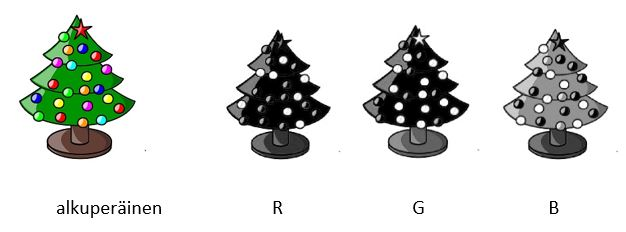

# Matriisit

Matriisi on riveihin ja sarakkeisiin järjestelty lukujen joukko. Kuitenkaan se ei ole aivan samanlainen olio kuin esimerkiksi taulukkolaskentaohjelmaan syötetty taulukko kuukausittaisista tuloista ja menoista. Matriisit voivat olla hyvinkin pieniä, mutta silti matemaattisesti tehokkaita. Esimerkiksi karttojen koordinaattimuutoksiin riittää neljä lukua sisältävä matriisi. Toisaalta matriisit voivat olla valtavan suuriakin, esim. tavallinen digitaalinen valokuva tallennetaan matriisina, jossa voi olla kymmeniä tuhansia lukuja.

Tietokoneella voidaan käsitellä matriiseja, joissa on kymmeniä tuhansia rivejä ja sarakkeita. Tällöin kuitenkin on syytä olla tietoinen siitä, että matriisienkin laskutoimituksissa ongelman sieventäminen kynällä ja paperilla saattaa säästää tietokoneen työskentelyyn tarvitsemaa aikaa merkittävästi. Matriisi voi olla myös useampiulotteinen. Silloin matriisissa on useita tavallisia matriiseja “päällekkäin”. Tällaisia matriiseja käytetään mm. kuvankäsittelyssä.

**Esim.** Oheinen joulukuusen kuva (lähde: Wikipedia) koostuu kolmesta matriisista. Kuvan värit muodostuvat eri yhdistelmistä punaista, vihreää ja sinistä. Yksi matriisi kertoo kuvan sisältämän punaisen värin määrän, toinen sinisen ja kolmas vihreän.

Tällä opintojaksolla matriiseja käytetään yhtälöryhmien ratkaisussa ja geometrisissa ongelmissa. Niitä voidaan hyödyntää myös esimerkiksi datan analysoinnissa ja kuvankäsittelyssä. Matriisilaskennalle löytyy sovelluksia esimerkiksi taloustieteestä, biologiasta ja fysiikasta. 

## Peruskäsitteitä

Matriisia merkitään jollakin kirjaimella, esimerkiksi $A$. Luvut, jotka muodostavat matriisit, merkitään taulukkoon isojen hakasulkujen sisälle. Joskus käytetään myös kaarisulkuja.

### Tyyppi ja alkiot

Matriisin tyyppi tarkoittaa: rivien määrä $\times$ sarakkeiden määrä.

**Esim.** Matriisin $A=\begin{bmatrix} 1 & 5 & 4 \\ 2 & 0 & 1 \\ 8 & 7 & 6 \\ 2 & 9 & 3\end{bmatrix}$ tyyppi on 4 $\times$ 3, koska siinä on 4 riviä ja 3 saraketta.

Matriisin $A$ alkio $a_{ij}$ tarkoittaa lukua, joka on matriisin rivillä $i$ ja sarakkeessa $j$. Alkioiden lukumäärä matriisissa on matriisin tyypissä esiintyvien lukujen tulo. Selkeyden vuoksi tarvittaessa voidaan alkiota merkitä myös $a_{i,j}$.

**Esim.** Edellä esitetyn matriisin $A$ alkioita ovat esimerkiksi $a_{11}=1, a_{13}=4, a_{32}=7$ ja $a_{41}=2$. Alkioita on yhteensä $4 \times 3 = 12$.

### Neliömatriisi ja  yksikkömatriisi

Jos matriisissa on yhtä monta riviä ja saraketta, eli jos sen tyyppi on muotoa $n \times n$, matriisi on neliömatriisi. Neliömatriiseihin liittyy erityisiä laskusääntöjä, joten on tärkeää tunnistaa, onko matriisi neliömatriisi. Neliömatriisille voidaan määrittää päälävistäjä, joka muodostuu alkioista $a_{1,1}, a_{2,2}, a_{3,3}, \ldots, a_{n-1,n-1}, a_{n,n}$.

**Esim.** Matriisi $A=\begin{bmatrix}5 & -1 & 0 \\ 3 & 1 & 3 \\ 4 & 2 & 2\end{bmatrix}$ on neliömatriisi, koska siinä on 3 riviä ja 3 saraketta.

Matriisin $A$ päälävistäjän alkiot ovat $a_{11}=5, a_{22}=1$ ja $a_{33}=2$.

Yksikkömatriisi on sellainen neliömatriisi, jonka päälävistäjän alkiot ovat ykkösiä (1) ja kaikki muut nollia (0). Yksikkömatriisia merkitään $I_n$, jossa $n$ on rivien ja samalla myös sarakkeiden lukumäärä.

**Esim.** $I_3$ on yksikkömatriisi, jonka tyyppi on 3 x 3, toisin sanoen $I_3=\begin{bmatrix}1 & 0 & 0\\ 0 & 1 & 0 \\ 0 & 0 & 1\end{bmatrix}$.

### Transpoosi

Matriisin $A$ **transpoosia** merkitään $A^T$. Transpoosin sarakkeet vastaavat matriisin $A$ rivejä siten, että matriisin $A$ $i$:s rivi muodostaa matriisin $A^T$ $i$:nnen sarakkeen. Jos $A$ on tyyppiä $p \times q$, niin transpoosi $A^T$ on tyyppiä $q \times p$. Yleisesti pätee, että $(A^T)^T=A$.

**Esim.** Matriisin $B=\begin{bmatrix}1 &2 \\ 2 & 4 \\ 3 & 1 \\ 6 & 0\end{bmatrix}$ transpoosi on $B^T=\begin{bmatrix}1 & 2 & 3 & 6 \\ 2 & 4 & 1 & 0\end{bmatrix}$.

Matriisin $B^T=\begin{bmatrix}1 & 2 & 3 & 6 \\ 2 & 4 & 1 & 0\end{bmatrix}$ transpoosi on $(B^T)^T = \begin{bmatrix}1 &2 \\ 2 & 4 \\ 3 & 1 \\ 6 & 0\end{bmatrix} = B$.