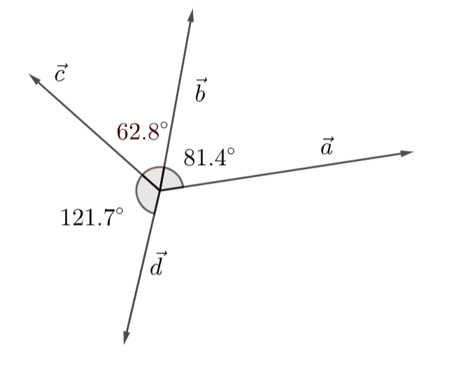

# Suuntakulmat ja napakoordinaattiesitys

Vektorin suuntakulma määritellään positiivisen $x$-akselin ja vektorin välisenä kulmana, ja se saadaan laskettua vektorin komponenteista suorakulmaisen kolmion geometrian avulla. 

**Esim.** Kuvan perusteella vektorin $\vec{AB}=3\vec{i}+2\vec{j}$ ja $x$-akselin välinen kulma $\alpha$ saadaan ratkaistua seuraavasti:

$\tan{\alpha}=\frac{2}{3} \leftrightarrow \alpha=\arctan⁡{\frac{2}{3}} \leftrightarrow \alpha \approx 33.69^{\circ}$.

## Napakoordinaattiesitys

Tasossa oleville vektoreille on olemassa ns. napakoordinaattiesitys, jossa vektorista annetaan sen pituus ja $x$-akselin suhteen määritetty kulma $\alpha$. Napakoordinaattiesitys vektorille $\vec{a}$ on $\vec{a}=|\vec{a}|\angle \alpha$.

**Esim.** Kuvan vektorin $\vec{AB}$ napakoordinaattiesitys on selvästi $\vec{AB} = 1.8 \angle 33.7^{\circ}$.

Miten esimerkin vektori voitaisiin ilmaista komponenttimuodossa? Kuvasta nähdään selvästi, että vektori on ainakin suunnilleen $1.5\vec{i}+\vec{j}$. Kuvan piirtäminen onkin oleellista vektorien esitystavan muunnoksissa.

### Muunnos napakoordinaattimuodosta komponenttimuotoon: 

Napakoordinaattimuotoinen vektori saadaan aina helposti muutettua komponenttimuotoon. Jos $\vec{a}=|\vec{a}| \angle \alpha$, niin 

- $a_x=|\vec{a}| \cos{\alpha}$

- $a_y=|\vec{a}|  \sin{\alpha}$  

millä tahansa kulman $\alpha$ arvolla.

**Esim.** Vektorin $\vec{a}=1.12 \angle 147^{\circ}$ komponenttimuotoinen esitys on $\vec{a}=1.12 \cos{147^{\circ}} \vec{i} + 1.12 \sin{147^{\circ}} \vec{j} \approx -0.94 \vec{i}+0.61 \vec{j}$. 

### Muunnos komponenttimuodosta napakoordinaattimuotoon:

Vektorin muuttaminen komponenttimuodosta napakoordinaattimuotoon kannattaa aloittaa hahmottelemalla, missä koordinaatiston neljänneksessä vektorin kärki on, kun se piirretään alkamaan origosta. Jos vektorin $\vec{a}=a_x \vec{i}+a_y \vec{j}$ ja $x$-akselin välinen kulma on alle 90 astetta, niin suuntakulma on $\alpha=\arctan{\frac{a_y}{a_x}}$. Muulloin käytetään trigonometriaa ja apukulmia. Tarkista lopuksi, että laskemasi suuntakulma sopii siihen koordinaatiston neljännekseen, jossa vektorin päätepiste on.

**Esim.** Määritä seuraavien vektorien napakoordinaattiesitykset.

a) $\vec{a}=2.56 \vec{i} + 4.67 \vec{j}$ 

b) $\vec{b}=-1.12 \vec{i} + 3.13 \vec{j}$ 

c) $\vec{c}=-4.50 \vec{i} – 2.55 \vec{j}$ 

d) $d=2.76 \vec{i} –4.32 \vec{j}$ 

:::{admonition} Ratkaisu
:class: tip, dropdown

Hahmotellaan aluksi vektorit koordinaatistoon ja piirretään tarvittavat apukulmat:

a) Vektorin pituus on $\sqrt{2.56^2+4.67^2} \approx 5.33$.

Kuvasta nähdään, että suuntakulma on $\alpha=\arctan⁡{\frac{4.67}{2.56}} \approx 61.27^{\circ}$.

Vektori voidaan siis esittää muodossa $\vec{a}=5.33 \angle 61.27^{\circ}$.

b) Vektorin pituus on $\sqrt{(-1.12)^2+3.13^2}\approx 3.32$.

Kuvasta nähdään, että suuntakulma on $90^{\circ}+\arctan{\beta'}=90^{\circ}+\arctan{\frac{1.12}{3.13}}\approx 109.7^{\circ}$.

Vektori voidaan siis esittää muodossa $\vec{b}=3.32 \angle 109.7^{\circ}$.

c) Vektorin pituus on $\sqrt{(-4.50)^2+(-2.55)^2}\approx 5.17$.

Kuvasta nähdään, että suuntakulma on $180^{\circ}+\arctan{\gamma'}=180^{\circ}+\arctan {\frac{2.55}{4.50}} \approx 209.5^{\circ}$. 

Vektori voidaan siis esittää muodossa $\vec{c}=5.17 \angle 209.5^{\circ}$.

d) Vektorin pituus on $\sqrt{2.76^2+(-4.32)^2} \approx 5.13$.

Kuvasta nähdään, että suuntakulma on $270^{\circ}+\arctan{\delta'}=270^{\circ}+\arctan{\frac{2.76}{4.32}}\approx 302.6^{\circ}$.

Vektori voidaan siis esittää muodossa $\vec{d}=5.13 \angle 302.6^{\circ}$.

:::

**Esim.** Samassa tasossa olevien vektorien $\vec{a}$, $\vec{b}$, $\vec{c}$ ja $\vec{d}$ väliset kulmat ovat: $(\vec{a},\vec{b})=81.4^{\circ},(\vec{b},\vec{c})=62.8^{\circ}$ ja $(\vec{c},\vec{d})=121.7^{\circ}$, ja vektorien pituudet ovat: $|\vec{a}|=6.45,|\vec{b}|=7.11,|\vec{c}|=4.82$ ja $|\vec{d}|=6.90$. Mikä on vektorien summa?

:::{admonition} Ratkaisu
:class: tip, dropdown

Valitaan $x$-akseliksi vektorin $a$ suunta. Vektorien suuntakulmat lasketaan nyt tämän vektorin suhteen.

Kirjoitetaan vektorien napakoordinaattiesitykset ja vastaavat komponenttiesitykset:

$\vec{a}=6.45 \angle 0^{\circ} =6.45 \cos{0⁡^{\circ}} \vec{i} + 6.45 \sin{0^{\circ}} \vec{j}$,

$\vec{b}=7.11 \angle 81.4^{\circ} =7.11 \cos{⁡81.4^{\circ}} \vec{i}+7.11 \sin⁡{81.4^{\circ}} \vec{j}$,

$\vec{c}=4.82 \angle (81.4+62.8)^{\circ} = 4.82 \cos{⁡144.2^{\circ}} \vec{i}+4.82 \sin{114.2^{\circ}} \vec{j}$,

$\vec{d}=6.90 \angle (144.2+121.7)^{\circ} = 6.90 \cos{⁡265.9^{\circ}} \vec{i} + 6.90 \sin{265.9^{\circ}} \vec{j}$.

Komponenttimuodosta voidaan laskea vektorien summa: $\vec{a}+\vec{b}+\vec{c}+\vec{d}=3.11 \vec{i}+2.97 \vec{j}$.

Summavektorin pituus on $\sqrt{3.11^2+2.97^2} \approx 4.30$.

Summavektorin suuntakulma on $\arctan⁡{\frac{2.97}{3.11}} \approx 43.7^{\circ}$.

Tällaisia laskuja voi soveltaa esim. fysiikassa, kun lasketaan samaan kappaleeseen vaikuttavien eri suuntaisten ja eri suuruisten voimien yhteisvaikutusta. Voimavektorien summa määrittää ns. kokonaisvoiman. Se puolestaan vaikuttaa kappaleen liikkeeseen Newtonin lakien mukaisesti.
 
:::