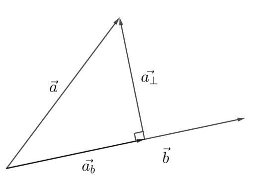

# Vektoriprojektio

Vektoriprojektio tai vektorin projektio on tärkeä käsite sellaisessa sovelluksissa, joissa etsitään lyhintä etäisyyttä suoralta johonkin pisteeseen. Vektoriprojektio laskemalla saadaan muodostettua projektiovektori. Se on olemassa aina kahden vektorin välillä: voidaan laskea vektorin $\vec{a}$ projektio vektorille $\vec{b}$ tai vektorin $\vec{b}$ projektio vektorille $\vec{a}$. Ensimmäistä tapausta merkitään $\vec{a_b}$ ja jälkimmäistä $\vec{b_a}$.

Seuraavan kuvan avulla voidaan esittää vektoriprojektiolle (tai projektiovektorille) määritelmä: Vektorin $\vec{a}$ projektio vektorille $\vec{b}$ eli $\vec{a_b}$ on vektorin $\vec{a}$ alkupisteestä alkava vektori, joka on 

- yhdensuuntainen vektorin $\vec{b}$ kanssa

- pituudeltaan sellainen, että piirtämällä kyseisen projektiovektorin kärjestä kohtisuora vektori päästään vektorin $\vec{a}$ loppupisteeseen.

Edellisten ehtojen mukaisesti vektoriprojektioon tarvitaan vektori $\vec{b}$, jota kerrotaan sopivalla kertoimella. Projektio lasketaankin kaavalla $\vec{a_b}=p\vec{b}$, missä tekijä $p=\frac{\vec{a}\cdot\vec{b}}{|\vec{b}|}^2$ on nimeltään skalaariprojektio. Skalaariprojektio on se luku, jolla vektori $\vec{b}$ pitää kertoa, jotta sen kärjestä pääsee suorassa kulmassa vektorin $\vec{a}$ kärkeen.

**Huom!** Pistetulon määritelmän mukaisesti $p=\frac{\vec{a}\cdot \vec{b}}{|\vec{b}|^2} = \frac{|\vec{a}||\vec{b}| \cos{\alpha}}{|b|^2} = \frac{|\vec{a}|}{|\vec{b}|} \cos{\alpha}$.

Tuloksena on siis $p\vec{b}=|\vec{a}| \cos{\alpha⁡} \frac{\vec{b}}{|\vec{b}|} = |\vec{a}| \cos{\alpha⁡} \cdot \vec{b}^0$, eli $\vec{b}$:n suuntainen yksikkövektori kerrottuna luvulla $|\vec{a}|\cos{\alpha}$.

Vektorin projektiota vastaan kohtisuora komponentti $\vec{a_{\perp}}$ saadaan vähentämällä vektorista sen projektio, siis $\vec{a_{\perp}}=\vec{a}-\vec{a_b}$. Tämän vektorin pituus on lyhin etäisyys vektorin $\vec{a}$ kärjen ja vektorin $\vec{b}$ määrittämän suoran välillä. Ylläoleva kuva auttanee hahmottamaan tämän laskutoimituksen perustelua.

**Esim.**  

a) Laske vektorin $\vec{a}=4\vec{i}$ projektio vektorille $\vec{b}=\vec{i}+\vec{j}$. 

b) Laske vektoriprojektio $\vec{a_b}$, kun $\vec{a}=4\vec{i}-5\vec{j}$ ja $\vec{b}=-6\vec{i}+2\vec{j}$.

:::{admonition} Ratkaisu
:class: tip, dropdown

a) $\vec{a_b}=\frac{\vec{a}\cdot \vec{b}}{|\vec{b}|^2} \cdot \vec{b} = \frac{4\cdot 1 + 0\cdot 1}{1^2+1^2} \cdot (\vec{i}+\vec{j}) = \frac{4}{2} (\vec{i}+\vec{j})=2\vec{i}+2\vec{j}$

b) $\vec{a_b}= \frac{4\cdot (-6)+(-5)\cdot 2}{(-6)^2+2^2} \cdot (-6 \vec{i}+2\vec{j}) =\frac{-24-10}{40}\cdot (-6 \vec{i}+2\vec{j})$

$=-\frac{34}{40} \cdot (-6 \vec{i})-\frac{34}{40} \cdot 2 \vec{j}= \frac{204}{40} \vec{i}-\frac{68}{40} \vec{j} \approx 5.1 \vec{i}-1.7 \vec{j}$

:::

**Esim.** Olkoot vektorit $\vec{A}=8\vec{i}+6\vec{j}-\vec{k}$ ja $\vec{B}=3\vec{i}-4\vec{j}+2\vec{k}$. Laske

a) vektorin $\vec{A}$ projektio vektorille $\vec{B}$.

b) vektorin $\vec{A}$ vektoria $\vec{B}$ vastaan kohtisuora komponentti. 

:::{admonition} Ratkaisu
:class: tip, dropdown

a) $\vec{A_B}=\frac{8\cdot 3+6 \cdot (-4)-1\cdot 2\{3^2+(-4)^2+2^2}\cdot (3\vec{i}-4\vec{j}+2\vec{k})$

$= \frac{24-24-2}{9+16+4} \cdot (3\vec{i}-4\vec{j}+2\vec{k})=-\frac{2}{29}\cdot(3\vec{i}-4\vec{j}+2\vec{k})$

$=-\frac{6}{29} \vec{i}+\frac{8}{29} \vec{j}-\frac{4}{29} \vec{k}\approx -0.207 \vec{i}+0.275\vec{j}-0.138\vec{k}$

Tarkistus WolframAlphan komennolla: projection[{8,6,-1},{3,-4,2}]

b) $\vec{A_{\perp}}=\vec{A}-\vec{A_B}=8\vec{i}+6\vec{j}-\vec{k}-(-0.207 \vec{i}+0.275 \vec{j}-0.138 \vec{k})$

$= (8+0.207) \vec{i}+(6-0.275) \vec{j}+(-1+0.138) \vec{k}=8.207 \vec{i} +5.725 \vec{j}-0.862 \vec{k}$

:::

**Esim.** Jaa vektori $\vec{a}$ kahteen komponenttiin, joista toinen on vektorin $\vec{b}$ suuntainen ja toinen sitä vastaan kohtisuorassa, kun vektorit ovat seuraavat: 

a) $\vec{a}=1.5\vec{i}+0.5\vec{j}$ ja $\vec{b}=2\vec{i}+2\vec{j}$,

b) $\vec{a}=4\vec{i}+2\vec{j}$ ja $\vec{b}=2\vec{i}+\vec{j}$.

:::{admonition} Ratkaisu
:class: tip, dropdown

a) $\vec{a_b}=\frac{1.5\cdot 2+0.5 \cdot 2}{2^2+2^2} \cdot (2 \vec{i}+2 \vec{j})=\frac{4}{8}\cdot (2 \vec{i}+2\vec{j})=\vec{i}+\vec{j}$

$\vec{a_{\perp}}=\vec{a}-\vec{a_b}=1.5 \vec{i}+0.5\vec{j}-(\vec{i}+\vec{j})=1.5\vec{i}+0.5\vec{j}-\vec{i}-\vec{j}=0.5\vec{i}-0.5\vec{j}$

b) $\vec{a_b}=\frac{4\cdot 2+2\cdot 1}{2^2+1^2}\cdot (2\vec{i}+\vec{j})=\frac{10}{5} \cdot (2\vec{i}+\vec{j})=4\vec{i}+2\vec{j}$

$\vec{a_{\perp}}=\vec{a}-\vec{a_b}=4\vec{i}+2\vec{j}-(4\vec{i}+2\vec{j})=0\vec{i}+0\vec{j}$

Miksi kohtisuoraa komponenttia ei ole olemassa? Huomataan, että vektori $\vec{b}$ saadaan kertomalla vektori $\vec{a}$ luvulla $\frac{1}{2}$. Vektorit ovat siis samansuuntaisia.

:::

**Esim.** Joki virtaa pisteestä $A=(700,100)$ suoraan pisteeseen $B=(1500,150)$. Joen vieressä pisteessä $C=(1000,50)$ on talo, josta halutaan tehdä lyhin mahdollinen polku joen rantaan pisteeseen $D$. Kuinka pitkä on kyseinen polku?

:::{admonition} Ratkaisu
:class: tip, dropdown

Muodostetaan aluksi pisteiden väliset vektorit: 

Jokea kuvaava vektori on $\vec{AB}=(1500-700,150-100) = (800,50) = 800 \vec{i} + 50\vec{j}$

Joen alkupisteestä talolle vie vektori $\vec{AC}=(1000-700,50-100) = (300,-50) = 300\vec{i} – 50\vec{j}$

Lyhimmän reitin löytämiseksi on laskettava vektorin $\vec{AC}$ projektio vektorille $\vec{AB}$, jonka jälkeen saadaan vektoria $\vec{AB}$ vastaan kohtisuora vektori $\vec{DC}$.

Skalaariprojektio on $p=\frac{\vec{AC}\cdot \vec{AB}}{|\vec{AB}|^2} = \frac{800\cdot 300-50\cdot 50}{800^2+50^2} \approx 0.37$.

Projektiovektori on $\vec{AC_{AB}}=p\vec{AB}=0.37\cdot 800 \vec{i}+0.37\cdot 50\vec{j}=296 \vec{i}+18.5 \vec{j}$.

Polkua kuvaava vektori on $\vec{CD}=\vec{AC}-\vec{AC_{AB}}=(300-296) \vec{i}+(-50-18.5) \vec{j} = 4 \vec{i}-68.5 \vec{j}$.

Polun pituudeksi saadaan $|\vec{CD}|=\sqrt{4^2+(-68.5^2} \approx 68.6$.

:::