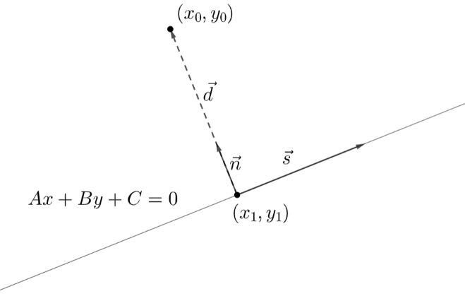

# Vektorit ja suorat

Suoraa eli lineaarista polynomifunktiota käsitellään yleensä ns. suoran yhtälön $y=ax+b$ avulla. Yhtälössä vakio $a$ on nimeltään kulmakerroin ja $b$ on leikkausvakio. Kulmakertoimen merkki kertoo suoran suunnan ja kulmakertoimen itseisarvo kertoo suoran jyrkkyyden. [Täältä](https://luma-lapinamk.github.io/minna-agt/lineaarinen.html) voit kerrata suoran yhtälön. Tässä luvussa tarkastellaan suoria vektorilaskennan näkökulmasta. Vektorien avulla voidaan esittää myös kolmessa ulottuvuudessa määriteltyjä suoria. Tässä kuitenkin käsitellään vain kaksiuloitteisen koordinaatiston suoria.

## Parametriesitykset

Muodostetaan aluksi suora vektorien avulla. Periaate on, että mennään ensiksi sopivan paikkavektorin $\vec{r_0}$ avulla mihin tahansa pisteeseen, joka varmasti on suoralla. Sitten valitaan vektori, joka määrää suoran suunnan. Nimitetään tätä vektoria suoran suuntavektoriksi $\vec{s}$. Mihin tahansa suoran pisteeseen pääsee lineaarikombinaatiolla $\vec{r}=\vec{r_0}+t\vec{s}$, missä $t$ on jokin reaaliluku. Tarvittavat vektorit on esitetty seuraavassa kuvassa.

Paikkavektori voidaan muodostaa, kun määritellään suoralta jokin piste $(x_0,y_0)$. Tämän pisteen sijainti voidaan esittää paikkavektorilla $\vec{r_0}= r_{0x} \vec{i} + r_{0y} \vec{j}$. Esimerkiksi jos suora kulkee pisteen $(3,4)$ kautta, niin paikkavektoriksi valitaan $\vec{r_0}=3 \vec{i}+4\vec{j}$.

Suuntavektorin kertoimien $s_x$ ja $s_y$ suhde määrittää suoran suunnan ja jyrkkyyden. Esimerkiksi jos haluamme suoran, jonka jyrkkyys vastaisi yhtälömuodossa esitetyn suoran $y=2x$ kulmakerrointa, niin suuntavektorin pystysuuntaisen kertoimen $s_y$ pitää olla kaksi kertaa niin suuri kuin vaakasuuntaisen kertoimen $s_x$. Mahdollisia suuntavektoreita on äärettömän monta, esimerkiksi $\vec{i}+2\vec{j}$, $2\vec{i}+4\vec{j}$, $5\vec{i}+10\vec{j}$ jne. 

Suoran **vektorimuotoinen parametriesitys** saadaan kirjoittamalla lineaarikombinaatio $\vec{r}=\vec{r_0}+t\vec{s}$. Esimerkiksi jos edellisen esimerkin suoran suuntavektoriksi valitaan $\vec{i}+2\vec{j}$, niin tätä suoraa voidaan siis kuvata vektorina 

$\vec{r}=3\vec{i}+4\vec{j}+t(\vec{i}+2\vec{j})$

Sulut avaamalla saadaan vektori sievennettyä muotoon

$\vec{r}=3\vec{i}+4\vec{j}+t\vec{i}+2t\vec{j}$

ja edelleen

$\vec{r}=(3+t)\vec{i}+(4+2t)\vec{j}$

Suoran suuntavektorin ja suoralla olevan pisteen saa valita vapaasti. Suuntavektorien kertoimien suhteen vain pitää pysyä samana, ja valitun pisteen pitää varmasti olla suoralla. Tällöin kyseessä on esitystavasta riippumatta sama suora!

Sana "parametri" viittaa vapaasti valittavaan lukuun $t$. Toisin sanoen, kun suoran määrittelee vektori $\vec{r}$, niin sillä suoralla pysytään millä tahansa luvun $t$ arvolla.

Edellisestä esitystavasta voidaan helposti muodostaa myös suoran **koordinaattimuotoinen parametriesitys**. Tässä esitysmuodossa kerätään $x$-koordinaatille ehdot vektorin $\vec{r}$ vaakasuuntaisen komponentin kertoimesta, ja $y$-koordinaatille vastaavasti pystysuuntaisen komponentin kertoimesta. Esimerkin tapauksessa koordinaattimuotoinen parametriesitys on

$\begin{equation}\begin{cases}x=3+t, \\ y=4+2t, t \in \Re\end{cases}\end{equation}$

Jokaista lukua $t$ vastaa jokin piste $(x,y)$, joka on koordinaattimuotoisen parametriesityksen määrittämällä suoralla. Esimerkiksi arvoa $t=0$ vastaa piste $(3,4)$ ja arvoa $t=1$ vastaa piste $(3+1,4+2)=(4,6)$.

## Suoran yhtälön yleinen muoto

Koordinaattimuotoisesta parametriesityksestä voidaan muodostaa suoran yhtälö $y=ax+b$. Kyseessähän on yhtälöpari, jossa on kolme tuntematonta $x,y$ ja $t$. Ratkaistaan $x$-koordinaatin lausekkeesta muuttuja $t$ ja sijoitetaan ja $y$-koordinaatin lausekkeeseen. Tällöin saadaan muodostettua yhtälö, jossa $t$ on eliminoitu, toisin sanoen $y$ esitetään $x$:n avulla. 

Esimerkiksi edellisen suoran tapauksessa yhtälöstä $x=3+t$ saadaan $t=x-3$. Sijoitetaan tämä yhtälöön $y=4+2t$:

$y=4+2(x-3)$

$y=4+2x-6$

$y=2x-2$

Joissakin sovelluksissa käytännöllisempi esitystapa on suoran yhtälön niinsanottu **yleinen muoto**. Tätä esitystapaa varten "tavallista" suoran yhtälöä vain muokataan sillä tavalla, että yhtälön oikealla puolelle jää nolla ja sitten termit järjestellään aakkosjärjestykseen. Yhtälön yleistä muotoa merkitään tässä $Ax+By=C=0$, missä isot kirjaimet ovat merkkinä siinä, että yhtälössä esiintyvät kertoimet eivät ole samoja kuin muodossa $y=ax+b$.

Edellisen esimerkin $y=2x-2$ yleinen muoto olisi siis $-2x+y+2=0$. Toisaalta aivan samaa suoraa kuvaa myös esimerkiksi yhtälö $-4x+2y+4=0$, joka on saatu kertomalla yhtälön molemmat puolet luvulla 2.

Seuraavissa esimerkeissä tarkastellaan samoja suoria eri tavoilla esitettynä. 

::::{admonition} Esimerkki

Muodosta eri esitysmuodot suoralle, joka kulkee pisteen $(6,6)$ kautta ja on vektorin $4\vec{i}+6\vec{j}$ suuntainen.

:::{admonition} Ratkaisu
:class: tip, dropdown

Suoralla olevan pisteen paikkavektori on $6\vec{i}+6\vec{j}$, joten suoran vektorimuotoinen parametriesitys on

$\vec{r}=6\vec{i}+6\vec{j}+t(4\vec{i}+6\vec{j})$

$\vec{r}=6\vec{i}+6\vec{j}+4t\vec{i}+6t\vec{j}$

$\vec{r}=(6+4t)\vec{i}+(6+6t)\vec{j}$

Koordinaattimuotoiseksi parametriesitykseksi saadaan vektorin kertoimista

$\begin{equation}\begin{cases}x=6+4t, \\ y=6+6t, t \in \Re\end{cases}\end{equation}$

Suoran yhtälöä varten ratkaistaan yhtälöstä $x=6+4t$ parametri $t=\frac{x-6}{4}$, ja sijoitetaan se yhtälöön $y=6+6t$:

$y=6+6\cdot \frac{x-6}{4}$

$y=6+\frac{6}{4}x-\frac{36}{4}$

$y=\frac{3}{2}x+3$

Edelleen suoran yhtälön yleinen muoto on $-\frac{3}{2}x+y-3=0$.

:::

::::

::::{admonition} Esimerkki

Muodosta eri esitysmuodot suoralle, jonka yhtälö on $5x-10y-15=0$.

:::{admonition} Ratkaisu
:class: tip, dropdown

Aluksi kannattaa muokata yleisestä muodosta esitysmuoto $y=ax+b$, sillä se helpottaa vektorimuotoisen esityksen muodostamista. Ratkaistaan siis suoran yleisestä yhtälöstä $y$:

$5x-10y-15=0$

$-10y=-5x+15$

$y=\frac{1}{2}x-\frac{3}{2}$

Vektorimuotoiseen parametriesitykseen tarvitaan jokin piste suoralta. Piste löytyy valitsemalla mikä tahansa luvun $x$ arvo ja laskemalla sitä vastaava $y$:n arvo. Erityisen helppo valinta on $x=0$, jolloin $y=-\frac{3}{2}$. Paikkavektoriksi saadaan siis $r_0=0\vec{i}-\frac{3}{2}\vec{j}$.

Suuntavektori saadaan suoran kulmakertoimesta. Koska tässä tapauksessa kulmakerroin on $\frac{1}{2}$, niin suuntavektorissa pystysuuntaisen komponentin kertoimen pitää olla puolet vaakasuuntaisesta. Sopiva suuntavektori on siis esimerkiksi $\vec{s}=\vec{i}+\frac{1}{2}\vec{j}$, mutta yhtä lailla esimerkiksi $\vec{s}=2 \vec{i}+\vec{j}$ vie samaan suuntaan ja samalla vältytään murtolukukertoimelta.

(Jos haluaa opetella ulkoa jonkin laskukaavan, niin eräs suoraa $y=ax+b$ vastaava suuntavektori on muotoa $\vec{s}=\vec{i}+a\vec{j}$.)

Vektorimuotoinen parametriesitys on siis 

$\vec{r}=\vec{r_0}+t\vec{s}$

$\vec{r}=-\frac{3}{2}\vec{j}+t(\vec{i}+\frac{1}{2}\vec{j})$

$\vec{r}=-\frac{3}{2}\vec{j}+t\vec{i}+\frac{1}{2}t\vec{j}$

$\vec{r}=t\vec{i}+(\frac{1}{2}t-\frac{3}{2})\vec{j}$

Koordinaattimuotoinen parametriesitys on 

$\begin{equation}\begin{cases}x=t, \\ y=\frac{1}{2}t-\frac{3}{2}, t \in \Re\end{cases}\end{equation}$

:::

::::

## Suoran normaali

Oletetaan, että suoran $y_1=a_1 x + b_1$ suuntavektori on $\vec{s_1}=\vec{i}+a_1 \vec{j}$, ja suoran $y_2=a_x 2 + b_2$ suuntavektori on $\vec{s_2}=\vec{i}+a_2 \vec{j}$. Suora $y_2$ on suoran $y_1$ normaali, jos suorat leikkaavat toisensa kohtisuorasti. Vektorimatematiikan käsittein ilmaistuna tämä tarkoittaa sitä, että suorien suuntavektorit $\vec{s_1}$ ja $\vec{s_2}$ ovat kohtisuorassa. Vektorit ovat kohtisuorassa, jos ja vain jos niiden pistetulo on nolla, joten $\vec{s_1}\cdot \vec{s_2}=0$. Ehto on siis $1\cdot 1 + a_1 \cdot a_2=0$.

Ehdosta saadaan ratkaisua $a_2=-\frac{1}{a_1}$. Saatiin siis suorien kulmakertoimille ehto, jonka perusteella suorat ovat toistensa normaaleja. Esimerkiksi suoran $y=3x+4$ normaali on jokin suora $y=-\frac{1}{3}x+b$.

Suorien kohtisuoruuteen ei liity mitään ehtoa leikkausvakiosta $b$. Jokaisella suoralla onkin äärettömän monta normaalia. Jos halutaan selvittää jonkin tietyn normaalin yhtälö, pitää tietää jokin piste jonka kautta normaali kulkee.

::::{admonition} Esimerkki

Muodosta suoralle $y=4x+5$ normaali, joka kulkee pisteen $(8,20)$ kautta.

:::{admonition} Ratkaisu
:class: tip, dropdown

Normaali on muotoa $y=-\frac{1}{4}x+b$.

Leikkausvakio on $b=y+\frac{1}{4}x$, ja sijoittamalla $x=8$ ja $y=20$ saadaan $b=20+\frac{1}{4}\cdot 8=20+2=22$.

Kysytty normaalin yhtälö on siis $y=-\frac{1}{4}x+22$.

Suoran $y=4x+5$ leikkausvakiota $5$ ei tarvittu mihinkään!

:::

::::

## Pisteen etäisyys suorasta

Vektorilaskennan yhteydessä opeteltiin vektoriprojektio, jonka avulla saatiin kohtisuora eli lyhin mahdollinen etäisyys jonkin pisteen ja vektorin välillä. Kun suora esitetään vektorina, voidaan vastaavasti laskea pisteen lyhin etäisyys suorasta. Laskukaavan johtaminen on pitkä ja on esitetty alla lisätietona. Laskukaavana pisteen $(x_0,y_0)$ etäisyys suoraan $Ay+Bx+C=0$ on

$d=\frac{|Ax_0+By_0+C|}{\sqrt{A^2+B^2}}$

:::{admonition} Perustelu
:class: tip, dropdown

Tarkastellaan kuvan suoraa, jonka yhtälö on $Ax+By+C=0$. Tämä voidaan esittää myös muodossa $y=-\frac{A}{B}x+\frac{C}{B}$. Tällöin suoran suuntavektoriksi voidaan valita $\vec{s}=\vec{i}-\frac{A}{B}\vec{j}$.

Muodostetaan vektori $\vec{d}$ jostakin suoran pisteestä $(x_1,y_1)$ pisteeseen $(x_0,y_0)$:

$\vec{d}=(x_0-x_1) \vec{i} + (y_0-y_1) \vec{j}$

Lisäksi tarvitaan suoran normaalivektori. Koska normaalivektorin ja suuntavektorin pistetulo on nolla, niin normaalivektori on $\vec{n}=\vec{i}+\frac{B}{A}\vec{j}$. 

Vektorin $\vec{d}$ pituus saadaan pistetulon geometrisesta määritelmästä: $\vec{n}\cdot \vec{d}=|\vec{n}||\vec{d}| \cos{\theta}$. Koska vektorit $\vec{n}$ ja $\vec{d}$ ovat yhdensuuntaisia (samansuuntaisia tai vastakkaissuuntaisia), niin niiden väliselle kulmalle pätee $\cos{\theta}=\pm 1$. Tällöin pistetulo voidaan kirjoittaa lyhyemmin $|\vec{n}\cdot \vec{d}|=|\vec{n}||\vec{d}|$.

Yhtälöstä ratkeaa kysytty pituus $|\vec{d}|=\frac{|\vec{n}\cdot \vec{d}|}{|\vec{n}|}$

Sijoitetaan aiemmin määritellyt vektorit:

$|\vec{d}|=\frac{|(\vec{i}+\frac{B}{A}\vec{j})\cdot ((x_0-x_1) \vec{i} + (y_0-y_1) \vec{j})|}{|\vec{i}+\frac{B}{A}\vec{j}|}$

Sievennetään pistetulo ja normaalivektorin pituus:

$|\vec{d}|=\frac{|(x_0-x_1)+\frac{B}{A}(y_0-y_1)|}{|\sqrt{1^2+(\frac{B}{A})^2}}$

Muokataan normaalivektorin pituuden esitysmuotoa:

$|\vec{d}|=\frac{|(x_0-x_1)+\frac{B}{A}(y_0-y_1)|}{\sqrt{\frac{A^2+B^2}{A^2}}}$

$|\vec{d}|=\frac{|(x_0-x_1)+\frac{B}{A}(y_0-y_1)|}{\frac{1}{A}\sqrt{A^2+B^2}}$

$|\vec{d}|=\frac{A|(x_0-x_1)+\frac{B}{A}(y_0-y_1)|}{\sqrt{A^2+B^2}}$

Lausekkeen osoittaja sievenee kertoimen $A$ avulla:

$|\vec{d}|=\frac{|Ax_0-Ax_1+By_0-By_1|}{\sqrt{A^2+B^2}}$

Koska piste $(x_1,y_1)$ on suoralla, niin sille pätee $Ax_1+By_1+C=0$. Siis voidaan kirjoittaa $-Ax_1-By_1=C$, jolloin osoittaja sievenee seuraavasti:

$|\vec{d}|=\frac{|Ax_0+By_0+C|}{\sqrt{A^2+B^2}}$

:::

::::{admonition} Esimerkki

Laske pisteen $(3,5)$ etäisyys suorasta $y=2x-4$.

:::{admonition} Ratkaisu
:class: tip, dropdown

Suoran yhtälön yleinen muoto on $-2x+y+4=0$. Etäisyyden kaavan sijoitettavat kertoimet ovat siis $A=-2, B=1$ ja $C=4$. 

Etäisyys on $d=\frac{|-2\cdot 3 + 1\cdot 5 + 4|}{\sqrt{(-2)^2+1^2}}=\frac{3}{\sqrt{5}}.$

:::

::::

